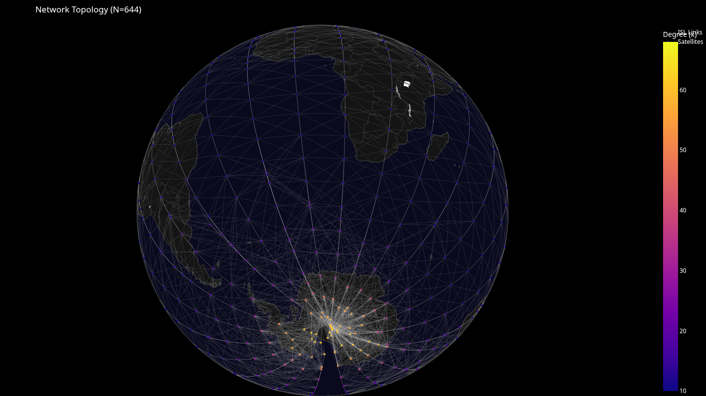
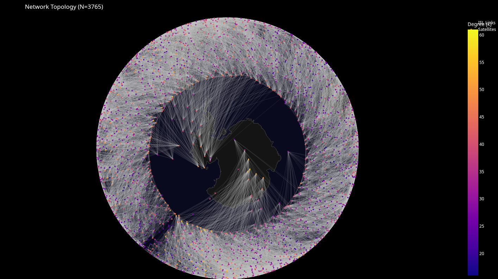

# comp123

This repo contains the simulation framework, analysis code, and results for a study investigating the characteristics, mainly the topological stability, of Low Earth Orbit (LEO) mega-constellations. Specifically, this project compares the **Walker-Delta (Starlink)** and **Walker-Star (OneWeb)** architectures to determine their [rich-club](https://doi.org/10.48550/arXiv.cs/0308036) status over time.
### Walker-Star (OneWeb)

### Walker-Delta (Starlink)


## Summary

* **`gen-temporal-graph.py`**: The main simulation engine. Fetches TLE data, propagates orbits using `skyfield` (SGP4), builds temporal graphs, and calculates network metrics.
* **`plot_results.py`**: Visualisation library. Generates static plots, the stability dashboard, and the interactive 3D globe.
* **`interactive.html`**: A fully interactive 3D visualisation of the satellite network plotted on an orthographic globe projection.
* **`*.png`**: Generated figures including degree distributions, stability comparisons, and topological metrics.
* **`*.gexf`**: Graph export files for further visualisation in Gephi.

## Getting Started

### Prerequisites

The simulation requires Python 3.8+:

```bash
pip install -r requirements.txt 

```

### Usage

To run the full simulation pipeline:

```bash
python gen-temporal-graph.py

```

This will:

1. Fetch the latest TLE data from CelesTrak (filtered for operational shells)
2. Simulate 95 minutes of orbital dynamics (one orbital period)
3. Generate topological metrics (Degree, Path Length, Clustering, Rich-Club, etc.)
4. Produce all output figures and the interactive HTML map

## Methodology

### Data Source

* **Starlink:** Filtered for the primary shell ($`530-550`$km altitude). *Note: A strict latitude filter ($`|\text{lat}|<54^{\circ}`$) is applied to exclude secondary polar shells and ensure analysis focuses on the main Walker-Delta configuration.*
* **OneWeb:** Filtered for operational altitude ($`1150-1250`$km).

| Parameter | Starlink (Walker-Delta) | OneWeb (Walker-Star) |
| :--- | :--- | :--- |
| **Altitude Shell** | 530 - 580 km | 1150 - 1250 km |
| **ISL Range (Max)** | 1,200 km | 2,500 km |
| **Latitude Filter** | $\|\text{lat}\| < 54^{\circ}$ (excl. polar shells) | None |
| **Link Logic** | Geometric Line-of-Sight distance | Geometric Line-of-Sight distance |

### Network Construction

* **Links (ISLs):** Established based on geometric proximity (Starlink: $`1,200`$km; OneWeb: $`2,500`$km) to approximate Line-of-Sight and laser link capabilities.
* **Rich-Club Definition:** Nodes are considered 'rich' if their degree exceeds the 90th percentile threshold ($`k>k_{\text{thresh}}`$) established at $`T=0`$.

### Network Metrics
* **Rich-Club Coefficient ($\phi$)**: Determines if high-degree nodes connect preferentially to each other.
* **Topological Stability**: Uses Jaccard Index and Kendall’s Tau to measure how much the core network changes over time.
* **Small-World Properties**: Compares Clustering Coefficients and Path Lengths against random null models.
* **Null Model Benchmarking**: Generates random configuration models for every timestamp to normalise results (calculating $\rho = \phi_{\text{real}} / \phi_{\text{rand}}$).
